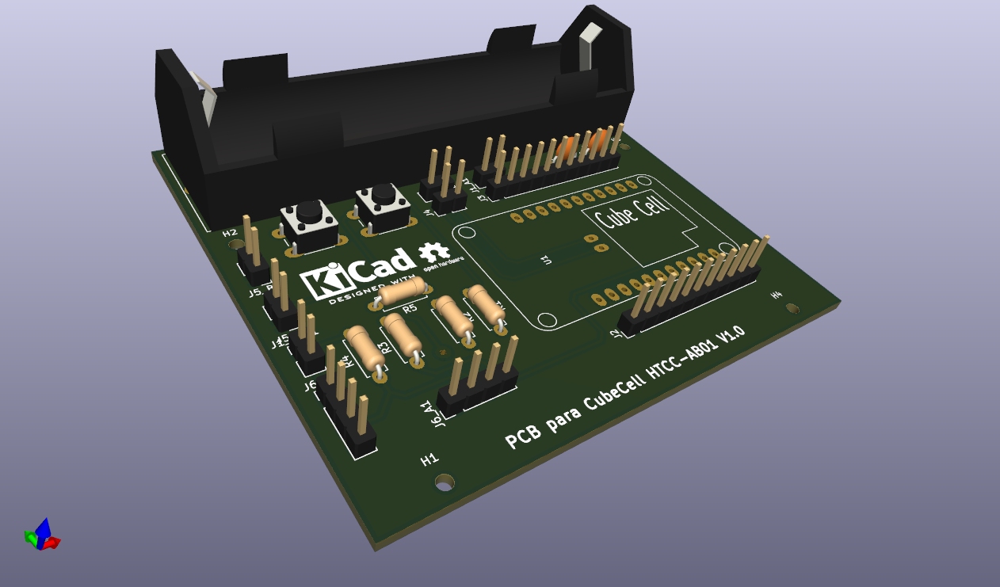

# Documentación sobre circuito impreso adaptador

[Esquema](./Adaptador_CubeCell_v1/docs/Adaptador_CubeCell_v1_sch.pdf) y [PCB](./Adaptador_CubeCell_v1/docs/Adaptador_CubeCell_v1_pcb.pdf) diseñados con [Kicad](https://www.kicad.org/)

Se ha diseñado para que se pueda alojar en esta [caja](https://a.aliexpress.com/_dWu4tJt)  

